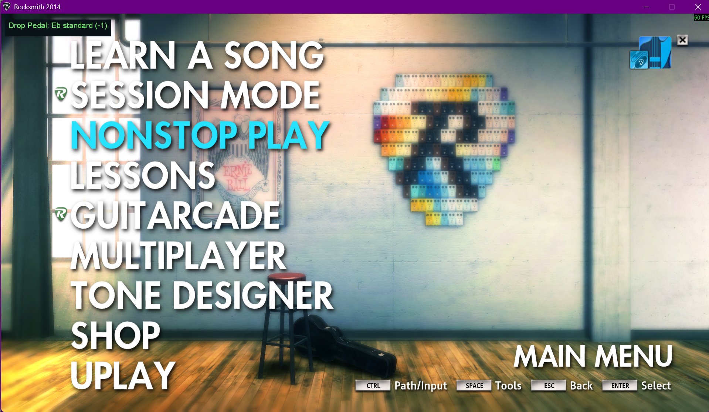

# RSModsPlus

A fork of [RSMods](https://github.com/Lovrom8/RSMods) that adds a drop pedal to
Rocksmith 2014.

RSModsPlus pitch-shifts the guitar signal before Rocksmith scores it. With the
ASIO engine, the shift is applied to the raw input before Rocksmith receives it.
With the Cable engine, the shift is applied through an in-game MultiPitch tone
and the tuning reference used by note detection is adjusted to match. Range is
-24 to +24 semitones.

To play an Eb song on a guitar in E standard, set the pedal to -1. Works for
guitar and for emulated bass.

**Setup and usage:** with RS_ASIO and an ASIO interface, follow the
**[ASIO Drop Pedal guide](docs/asio-drop-pedal.md)**. With a Real Tone cable and
no RS_ASIO, follow the
**[Cable Drop Pedal guide](docs/cable-drop-pedal.md)**.

---

## What this fork adds

- A drop pedal, -24 to +24 semitones. With RS_ASIO, the shift is applied before
  Rocksmith processes the input, so stock tones, custom tones, the tuner and
  note detection all receive the shifted signal.
- A fallback engine, the Cable Drop Pedal, for setups without RS_ASIO, such as
  a Real Tone cable with nothing else in the chain.
- A base tuning setting, so the pedal offsets from whatever your guitar is
  physically in rather than from E.
- An on-screen readout of the current state, named relative to the base tuning.

Everything else comes from RSMods 1.2.8.2 and behaves as upstream documents it:
extended range mode, custom song list titles, toggle loft, force re-enumeration,
GuitarSpeak, and the rest. See
[upstream's README](https://github.com/Lovrom8/RSMods#readme) for that list and
for the full `RSMods.ini` reference.

---

## Installing

This is built from RSMods 1.2.8.2 and uses the same filename, so it replaces
RSMods' own `xinput1_3.dll` rather than sitting beside it. Only one of the two
can be loaded at a time.

**If you already have RSMods installed, back up the existing `xinput1_3.dll`
first.** Copy it somewhere outside the game folder, or rename it. That copy is
how you get back to plain RSMods later.

Then download `xinput1_3.dll` from the
[latest release](https://github.com/Cheesewizard/RSModsPlus/releases) and put it
in your Rocksmith 2014 folder, next to `Rocksmith2014.exe`, overwriting the file
that is already there.

Your `RSMods` folder, the settings app and `RSMods.ini` are untouched and carry
on working, since this is the same 1.2.8.2 codebase with the drop pedal added.

To uninstall, put your backup back. If you had no RSMods before this, deleting
the file is enough.

Requirements are upstream's: Steam Rocksmith 2014 Remastered on Windows, and the
MS Visual C++ 2015-2019 redistributable. The ASIO engine additionally needs
[RS_ASIO](https://github.com/mdias/rs_asio) and an ASIO audio interface, which
is the setup most interface players already have.

With RS_ASIO there is no in-game setup at all: the pedal works on every tone.
Without it, the Cable Drop Pedal needs a tone containing a MultiPitch pedal,
covered in [its guide](docs/cable-drop-pedal.md).

---

## How it works

RSModsPlus selects one drop pedal engine at launch. Both engines use the same
hotkeys and overlay readout. The active engine is shown on screen beside the
pedal readout and written to the debug log using the format
`Drop pedal engine: ...`.

**ASIO Drop Pedal.** With RS_ASIO installed, the mod hooks the ASIO driver below
RS_ASIO and shifts the raw guitar input before Rocksmith receives it. The
shifter uses period-synchronous splicing, so note detection, the tuner and tone
processing all consume the same shifted input signal. No tuning-reference
redirect is required, and stock tones work as well as custom tones.

Additional processing latency is bounded by one detected pitch period of the
note being played, roughly 1-13 ms depending on pitch. This is added to the
normal RS_ASIO round trip, about 15 ms on a typical interface at a 256-frame
buffer.

For guitar-to-bass with ASIO, the lowest-latency path is to tell Rocksmith you
are playing bass and include the octave in the pedal value, such as `-12` for
E-standard bass from an E-standard guitar. That shifts before the game hears the
signal and avoids Rocksmith's emulated-bass post-processing path.

**Cable Drop Pedal.** Without RS_ASIO, detection reads the raw signal
upstream of the tone chain, so the mod shifts inside the game instead: it
retunes a MultiPitch pedal in the player's tone and redirects the reference
frequency the game derives its expected pitch from. This is the same value CDLC
charters set as an arrangement's tuning pitch. Shift the audio down a semitone,
move the expectation up one, and the two agree. This engine needs the
MultiPitch pedal in the tone and covers uniform tunings only.

Reverse-engineering notes, including everything that was ruled out along the
way, are in [docs/wwise-plugin-internals.md](docs/wwise-plugin-internals.md).

---

## Roadmap

V2 shifts the guitar input below RS_ASIO, so every tone receives the shifted
signal without tone setup. The Cable Drop Pedal stays as the fallback for chains
without RS_ASIO.

Next:

- Shifting the song's tuning instead of the guitar, so playing without
  headphones works: the guitar's acoustic sound and the game would be in the
  same tuning instead of a semitone apart in the room.
- Refine period detection for very softly played notes, which can occasionally
  add a warbled effect to the shifted signal.

---

## Documentation

| Document | Covers |
|---|---|
| [docs/asio-drop-pedal.md](docs/asio-drop-pedal.md) | ASIO Drop Pedal: requirements, controls, playing, bass, troubleshooting |
| [docs/cable-drop-pedal.md](docs/cable-drop-pedal.md) | Cable Drop Pedal: tone setup, constraints, bass, troubleshooting |
| [docs/wwise-plugin-internals.md](docs/wwise-plugin-internals.md) | How the Wwise pitch shifter is reached, and what was ruled out |

---

## Issues

Drop pedal problems go
[on this repository](https://github.com/Cheesewizard/RSModsPlus/issues), not on
upstream's tracker. This feature isn't theirs to support.

A bug in an inherited RSMods feature that reproduces on a stock upstream build
belongs [upstream](https://github.com/Lovrom8/RSMods/issues).

A debug log is written to `RSMods_debug.txt` beside `Rocksmith2014.exe`. It is
overwritten on every launch and locked while the game runs, so quit before
copying it. Attaching it makes a bug report far easier to act on.

---

## Credits

RSMods is the work of **Lovrom8** and **ffio1**, with contributions from
ZagatoZee, Kokolihapihvi and L0fka. This fork is the drop pedal on top of their
project. If you find the rest of the mod suite useful, thank them.

[RS_ASIO](https://github.com/mdias/rs_asio) by **mdias** is what makes the ASIO
engine possible; the ASIO Drop Pedal lives underneath it.

The reference-frequency technique the Cable Drop Pedal relies on is the same
one CDLC charters have long used to move a chart's expected notes by setting an
arrangement's tuning pitch.
