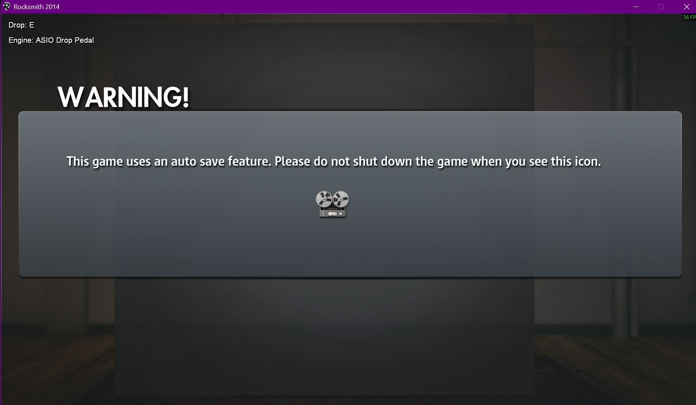

# ASIO Drop Pedal

Shifts the guitar's pitch before the game receives it, so songs in any tuning
can be played without touching a tuning peg. Range is -24 to +24 semitones. To
play an Eb song on a guitar in E standard, set the pedal to -1. Works for
guitar and for emulated bass.

This guide covers the ASIO engine. For setups without RS_ASIO, see the
[Cable Drop Pedal guide](cable-drop-pedal.md).

## Requirements

- [RS_ASIO](https://github.com/mdias/rs_asio) with an ASIO audio interface.
- Input formats `ASIOSTFloat32LSB`, `ASIOSTInt32LSB`, `ASIOSTInt24LSB` and
  `ASIOSTInt16LSB` are supported.
- No in-game setup. The pedal operates on every tone, stock or custom.
- The pedal shifts the one channel `[Asio.Input.0]` names. In multiplayer the
  second player (`[Asio.Input.1]`) plays unshifted, with detection unaffected.

The engine is selected at launch and announced beside the pedal readout, then
fades after a few seconds:

The same line is written to the debug log (`Drop pedal engine: ...`). In
automatic mode the pedal starts with Cable ownership and promotes to ASIO when
the input chain is ready. If the notice remains `Cable Drop Pedal`, the ASIO
chain did not initialize; see [troubleshooting](#troubleshooting).

## How it works

The mod hooks the ASIO driver underneath RS_ASIO and pitch shifts the raw
guitar signal before the game receives it. The shifter uses period-synchronous
splicing. Rocksmith receives a shifted input signal, so detection, the tuner and
tone processing operate on the same pitch-shifted audio. The pedal does not
modify Rocksmith's tuning reference. Arrangements authored for A != 440 retain
that reference, so the guitar must be true-tuned as Rocksmith normally requires
before applying the semitone shift.

The shifter trails the input by up to one pitch period of the note being
played (roughly 1-13 ms depending on the string), on top of the interface's
normal round trip (~15 ms at 256 frames / 48 kHz on a typical interface).
At a zero-semitone target or while disabled, it bypasses detection and splicing
and returns the input unshifted, adding no pitch-shifter delay. The lightweight
format conversion and history update still run so engaging the pedal starts from
live input instead of an empty delay line.

## Controls

| Action | Key |
|---|---|
| Pitch down / up | `,` / `.` |
| Toggle on / off | `F7` |
| Base tuning down / up | `F9` / `F10` |

- Keys register only while Rocksmith is the focused window.
- While the pedal is toggled off, every key except `F7` is ignored.
- Keys are rebindable in the settings app (Tuning tab), or under `[Keybinds]`
  in `RSMods.ini` (`DropPedalPitchDownKey`, `DropPedalPitchUpKey`,
  `DropPedalToggleKey`, `DropPedalBaseTuningDownKey`,
  `DropPedalBaseTuningUpKey`). The table above shows the defaults.

The overlay shows the current state and turns green whenever a shift is
applied. Nothing is saved between sessions: the pedal starts enabled, at no
shift, base E standard, every launch.

### Base tuning

`F9` / `F10` tell the mod what the guitar is physically tuned to. It changes
how tunings are named, nothing else: names are computed relative to the base,
so with a base of D standard, one semitone down reads `Db standard (-1)`.
Leave it at E standard unless the guitar really is tuned differently.

## Playing

- The tuner reads the *shifted* pitch: with the pedal at -2, an E standard
  guitar registers as D. Set the pedal to the song's tuning and standard
  fingering registers.
- Changing the pedal mid-song moves audio and detection together; they cannot
  drift apart. This includes the tuner screen, because the game only sees the
  already-shifted input.

## Emulated bass

Emulated bass works normally with this engine. If Rocksmith is in emulated-bass
mode, use the song offset only: for an Eb song, set the pedal to `-1`.

For the lowest-latency guitar-to-bass setup, tell Rocksmith you are playing
bass and let the ASIO pedal supply the octave before the game hears the signal.
On an E-standard guitar, set the pedal to `-12` for E-standard bass, `-13` for
Eb bass, and so on. This avoids Rocksmith's emulated-bass post-processing path.

## Troubleshooting

| Symptom | Cause |
|---|---|
| Engine notice reads `Cable Drop Pedal` | The ASIO chain did not initialize. Check `RS_ASIO.ini` names the interface under `[Asio.Input.0]` |
| Game reports "no audio output device" on launch | Another program changed the interface's sample rate (DAWs and amp sims do this silently). Set it back to 48000 Hz in the interface's control panel and relaunch |
| Tuner reads a different tuning than the guitar is in | The shift, working as designed |
| Pitch keys do nothing | Pedal toggled off (`F7`), or Rocksmith is not the focused window |
| Multiplayer: player 2 hears no shift | The pedal shifts only the `[Asio.Input.0]` channel |

Logging is opt-in: enable it from the settings app before reproducing the
issue, or the log will not exist. The log is `RSMods_debug.txt`, next to
`Rocksmith2014.exe`, not in the `RSMods` subfolder. It is overwritten on every
launch and locked while the game runs, so quit before copying it.
