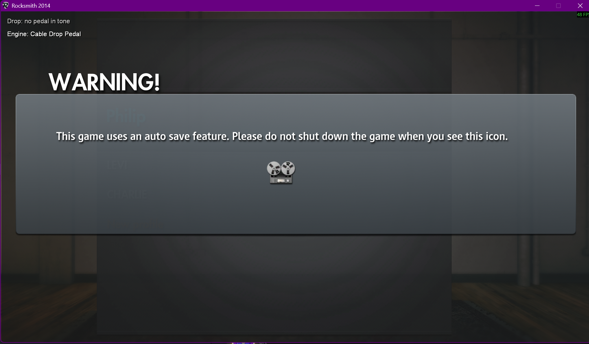
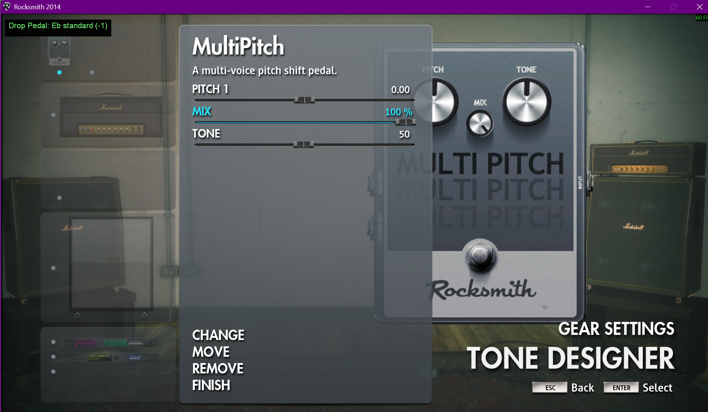
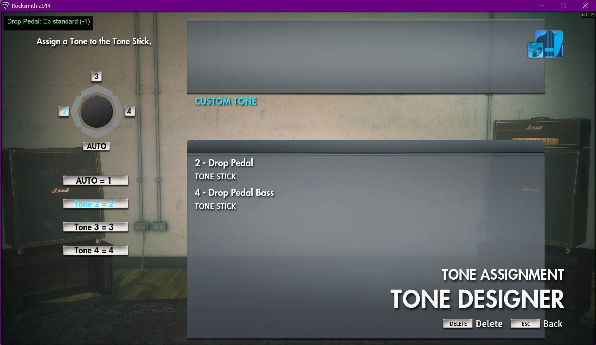

# Cable Drop Pedal

Shifts the guitar's pitch so songs in any tuning can be played without
touching a tuning peg. Range is -24 to +24 semitones. To play an Eb song on a
guitar in E standard, set the pedal to -1. Works for guitar and for emulated
bass.

This guide covers the engine used without RS_ASIO, such as a Real Tone cable
with nothing else in the chain. With RS_ASIO and an ASIO interface installed,
the default `Automatic` setting uses the [ASIO Drop Pedal](asio-drop-pedal.md)
instead, which needs no setup. Set `[Drop Pedal] Engine = Cable` to force this
engine.

The engine is selected at launch and announced beside the pedal readout, then
fades after a few seconds:

The same line is written to the debug log (`Drop pedal engine: ...`). The
engine cannot change without relaunching. Forced `Cable` skips the ASIO input
hooks and always uses the MultiPitch path.

## How it works

Detection reads the raw guitar signal upstream of the tone chain, so the shift
happens inside the game: the mod retunes a MultiPitch pedal in the player's
tone and redirects the reference frequency the game derives its expected pitch
from. This is the same value CDLC charters set as an arrangement's tuning pitch.
Shift the audio down a semitone, move the expectation up one, and the two
agree.

Constraints that follow from this design:

- A tone containing a MultiPitch pedal is required; stock tones do not work.
- The pedal must be set before entering the tuner (see
  [the tuner latch](#the-tuner-latch)).
- Uniform tunings only.
- Tones reset per song, so the tone slot key is pressed each time.

## Controls

| Action | Key |
|---|---|
| Pitch down / up | `,` / `.` |
| Toggle on / off | `F8` |
| Base tuning down / up | `F9` / `F10` |

- Keys register only while Rocksmith is the focused window.
- While the pedal is toggled off, every key except `F8` is ignored.
- These are defaults. Rebind them in the settings app or edit
  `[Keybinds] DropPedalPitchDownKey`, `DropPedalPitchUpKey`,
  `DropPedalToggleKey`, `DropPedalBaseTuningDownKey` and
  `DropPedalBaseTuningUpKey`.

The overlay shows the current state and turns green whenever a shift is
applied. Nothing is saved between sessions: the pedal starts enabled, at no
shift, base E standard, every launch.

### Base tuning

`F9` / `F10` tell the mod what the guitar is physically tuned to. It changes
how tunings are named, nothing else: names are computed relative to the base,
so with a base of D standard, one semitone down reads `Db standard (-1)`.
Leave it at E standard unless the guitar really is tuned differently.

## Setup: build the tone

Add a **MultiPitch** to a tone in the Tone Designer with these settings:

| Setting | Value | Why |
|---|---|---|
| **Pitch 1** | `0.00` | The mod's shift is *additive*. Any non-zero value here offsets everything. |
| **Mix** | `100 %` | Defaults low. At 0 the shifted signal is inaudible. |
| **Tone** | anything | No functional effect. |

Two properties of the Tone Designer affect this setup:

- **MultiPitch can only occupy the pre-pedal slot, and there is exactly one.**
  Adding it *deletes* whatever pre-effect the tone already had.
- **A tone copied from an octave-down one still plays an octave down at 0
  semitones.** The tell is that shifting *up* by that amount sounds correct.
  The copy brought a non-zero Pitch 1 with it.

## Setup: assign it to a tone slot

Emulated bass has its **own** tone slots, but slot *numbers* are shared
between instruments. Put the guitar and bass drop pedal tones on **different
slot numbers**, as above with guitar on 2 and bass on 4, or they will need
reassigning in the Tone Designer on every instrument switch.

## The tuner latch

**Set the pedal before entering the tuner.**

This engine shifts downstream of detection and corrects the expected pitch
instead, and the game reads that expectation once, when the tuner comes up.
Changing the pedal mid-song moves *only* the audio; the game carries on
scoring against what it latched, so what is heard and what is graded drift
apart. Back out to the menu, change the pedal, and re-enter.

Do not press the pitch keys while the game's tuner screen is actively
listening. The tuner assumes a stable instrument, and a pitch that moves
mid-listen can strand it waiting; backing out of the screen and re-entering
recovers it.

## Emulated bass

Emulated bass is a Cable Drop Pedal tone setup issue, not a different pedal
value. Adding a MultiPitch removes Rocksmith's `Pedal_BassEmulator`, so a bass
pedal tone must put the missing octave back in the tone itself.

- **Bass tone:** `Pitch 1 = -12`. This replaces the octave normally supplied by
  `Pedal_BassEmulator`.
- **Pedal:** the song offset only. For an Eb song, set the pedal to `-1`, not
  `-13`.

Putting the octave in the pedal can make the audio sound right, but it sends
the tuning correction an octave away from what Rocksmith expects. The result is
shifted bass audio with notes that do not register. Keep separate guitar and
bass pedal tones, then use the pedal only for the song's tuning offset.

## Troubleshooting

| Symptom | Cause |
|---|---|
| Pedal changes nothing at all | Current tone has no MultiPitch; press the slot key |
| Audio shifts but sounds thin or silent | MultiPitch **Mix** is not at 100 |
| Everything sounds an octave down at 0 semitones | Tone's **Pitch 1** is not 0 |
| Notes do not register in-game | Pedal changed after the tuner; back out and re-enter |
| Bass: audio right, nothing registers | Octave is in the pedal instead of the tone's Pitch 1 |
| Game tuner screen stuck listening | Pedal changed mid-listen; back out of the screen and re-enter |
| Pitch keys do nothing | Pedal toggled off (`F8`), or Rocksmith is not the focused window |

The debug log is `RSMods_debug.txt`, next to `Rocksmith2014.exe`, not in the
`RSMods` subfolder. It is overwritten on every launch and locked while the
game runs, so quit before copying it.
