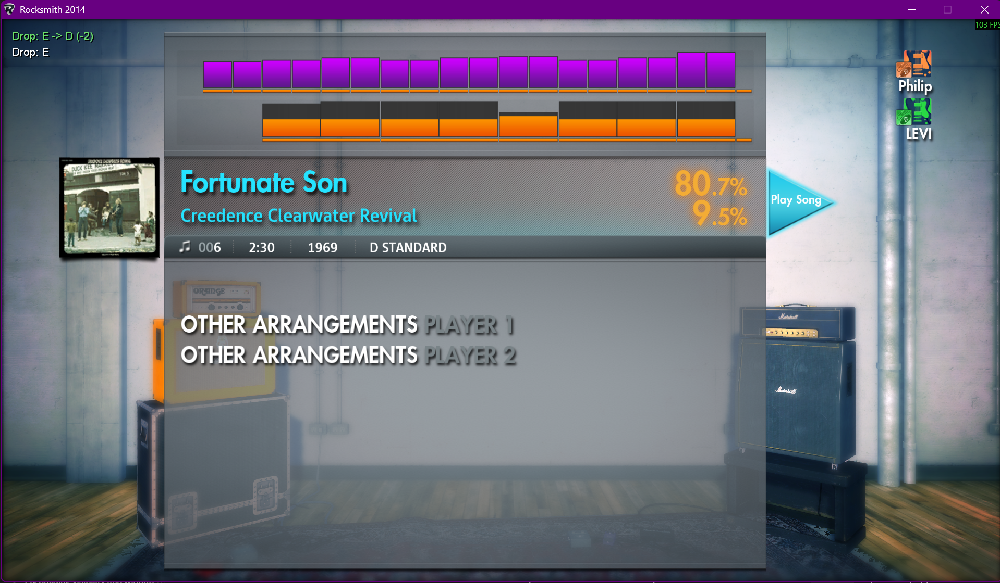
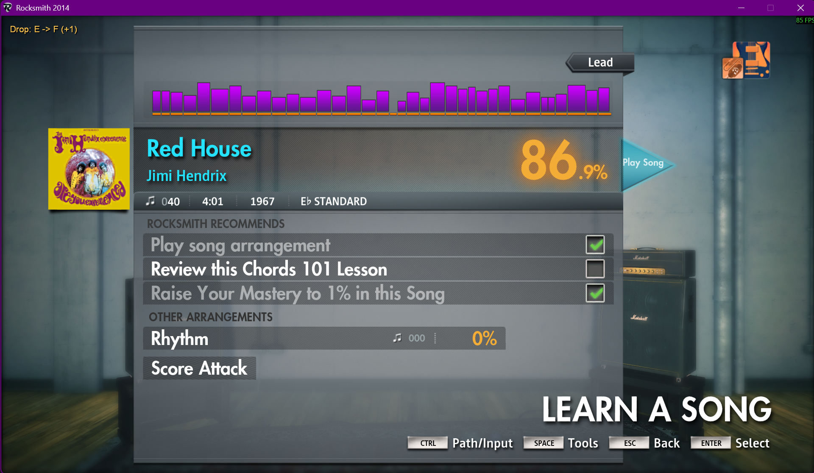
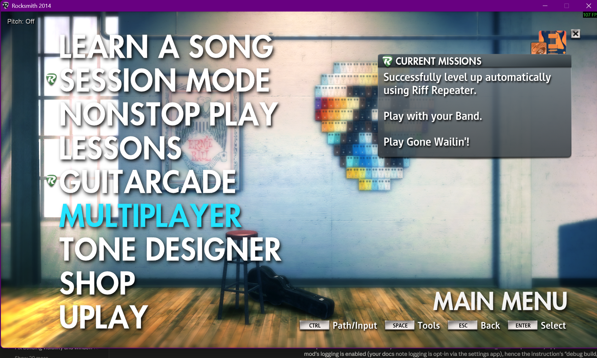
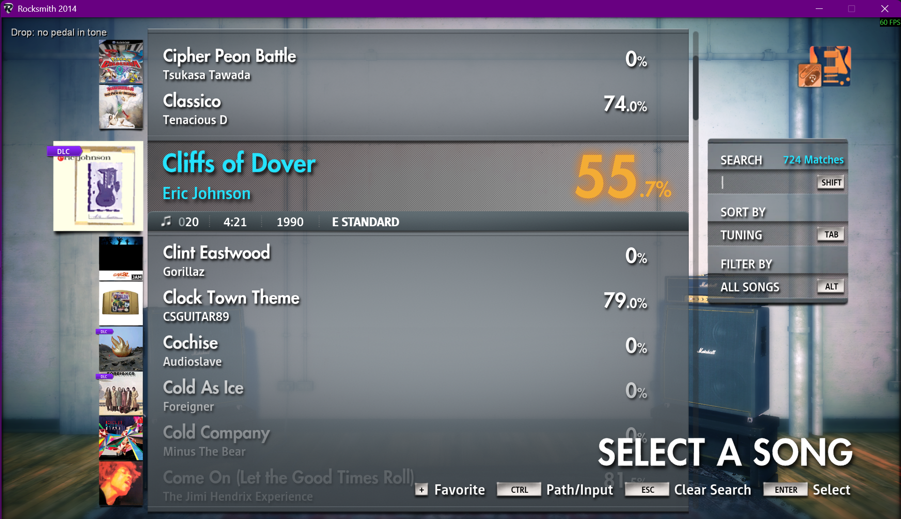

# Cable Drop Pedal

Shifts the guitar tone without touching a tuning peg and keeps Rocksmith's
tuner and note detection aligned with the shift. Range is -24 to +24
semitones. To play an Eb song on an E-standard guitar, set the pedal to -1.

This guide covers the game-side engine used without RS_ASIO, such as a Real
Tone cable with nothing else in the chain. It can also be selected explicitly
with `Engine = cable` while an ASIO interface supplies Rocksmith's input. In
automatic mode a working RS_ASIO input uses the
[ASIO Drop Pedal](asio-drop-pedal.md) instead, which needs no tone setup.

The engine is selected at launch and announced beside the pedal readout, then
fades after a few seconds:

The same line is written to the debug log (`Drop pedal engine: ...`). In
automatic mode Cable owns the pitch until a working ASIO input chain becomes
available.

In multiplayer each player has an independent target and base tuning, exactly
like the ASIO engine: every tone's pitch shifter and every player's detection
reference follow the player owning it, so a song with different arrangement
tunings stays playable for both. Player 2 uses `Control` plus the Player 1
keys. The overlay always shows each player's own pedal state, like hardware.

Multiplayer tone setup:

- Tones live on the player profile, so **each profile needs its own drop pedal
  tone** built per the setup below; one profile's tones are not visible to the
  other player.
- In multiplayer the keyboard maps both players' tone slots: keys `1`-`4` load
  Player 1's tone slots and keys `5`-`8` load Player 2's tone slots `1`-`4`.

## How it works

Detection reads the raw guitar signal upstream of the tone chain, so the mod
keeps two values in step: it retunes a MultiPitch pedal for the audible signal
and transposes the active arrangement tuning reference for the tuner and note
detection. If the pedal target is `s` semitones and the arrangement was authored
at `f` Hz, the detection reference is `f * 2^(-s / 12)`. The exact authored
value is restored when the pedal is disabled, the song ends, or ASIO takes
ownership.

Two mechanisms keep the reference in step. The game's reference builder — the
function that converts an arrangement's cent offset into the detection
frequency, `440 * 2^(cents / 1200)` — is detoured, and the cent offset is
adjusted on the way in, so the value stamped at song load already carries the
shift and every consumer, including the pre-song tuner's load-time snapshot,
agrees with it. Live target changes mid-song are then written directly to the
stamped value. Because the adjustment is applied to the authored cents rather
than replacing them, non-A440 arrangements and the `-1200` emulated-bass offset
compose correctly.

The pre-existing `DisableTrueTuning` mod remains available unchanged and is
independent of the Drop Pedal. The Drop Pedal does not call or modify it; it
uses its own reference-builder hook and live reference writes. Builder
addresses are defined for Remastered September 2022 and Learn & Play December
2024.

Constraints that follow from this design:

- A tone containing a MultiPitch pedal is required; stock tones do not work.
- Uniform tunings only.
- Tones reset per song, so the tone slot key is pressed each time.
- Set the target before launching the song, so the load-time stamp already
  carries the shift when the tuner reads it. This includes Non-Stop Play: the
  target applies per song at load, so set it before starting the playlist, or
  during the between-song countdown when songs need different offsets. A change
  that lands after a song has loaded corrects in-song detection within a
  moment, but that song's tuner snapshot stays stale.
- The full pedal range of -24 to +24 semitones renders (verified in game on a
  Pitch 1 = 0 tone). The tone's authored Pitch 1 adds to the pedal target in
  the one MultiPitch instance, so an octave-down bass tone shifts its audible
  result by that authored offset on top of the pedal value.

## Controls

| Action | Player 1 | Player 2 |
|---|---|---|
| Pitch down / up | `,` / `.` | `Control+,` / `Control+.` |
| Toggle on / off (both players) | `F7` | `F7` |
| Base tuning down / up | `F9` / `F10` | `Control+F9` / `Control+F10` |

- Keys register only while Rocksmith is the focused window.
- While the pedal is toggled off, every key except `F7` is ignored.
- Keys are rebindable in the settings app (Tuning tab), or under `[Keybinds]`
  in `RSMods.ini` (`DropPedalPitchDownKey`, `DropPedalPitchUpKey`,
  `DropPedalToggleKey`, `DropPedalBaseTuningDownKey`,
  `DropPedalBaseTuningUpKey`). The table above shows the defaults.

The overlay shows the current state: green for a downward shift, amber for an
upward one.

`F7` toggles the pedal for the session, and the row reports it:

When the loaded tone has no MultiPitch the pedal cannot act, so the row says so
instead of showing a target that is not being applied — the game reloads tones
every song, so this is the first thing to check when nothing shifts. The target
itself is kept and reapplies the moment a pedal tone loads:

Nothing is saved between sessions: the pedal starts enabled, at no shift, base
E standard, every launch.

### Base tuning

`F9` / `F10` tell the mod what the guitar is physically tuned to. It changes
how tunings are named, nothing else: names are computed relative to the base,
so with a base of D standard, one semitone down reads `D -> Db (-1)`.
Leave it at E standard unless the guitar really is tuned differently.

## Setup: build the tone

Add a **MultiPitch** to a tone in the Tone Designer with these settings:

| Setting | Value | Why |
|---|---|---|
| **Pitch 1** | `0.00` | The mod's shift is *additive*. Any non-zero value here offsets everything. |
| **Mix** | `100 %` | Defaults low. At 0 the shifted signal is inaudible. |
| **Tone** | anything | No functional effect. |

Two properties of the Tone Designer affect this setup:

- **MultiPitch can only occupy the pre-pedal slot, and there is exactly one.**
  Adding it *deletes* whatever pre-effect the tone already had.
- **A tone copied from an octave-down one still plays an octave down at 0
  semitones.** The tell is that shifting *up* by that amount sounds correct.
  The copy brought a non-zero Pitch 1 with it.

## Setup: assign it to a tone slot

Emulated bass has its **own** tone slots, but slot *numbers* are shared
between instruments. Put the guitar and bass drop pedal tones on **different
slot numbers**, as above with guitar on 2 and bass on 4, or they will need
reassigning in the Tone Designer on every instrument switch.

## Note detection and true tuning

The in-game tuner and note detection receive the unshifted input, while the
player hears the shifted MultiPitch output. Transposing the arrangement
reference makes those paths agree: at `-1`, an Eb arrangement accepts the raw E
input and the tone shifts that input down to the Eb heard with the backing
track.

At target `0` the authored reference is left unchanged. This matters for songs
authored away from A440: an E-standard arrangement at A428.71 still requires
the guitar to be true-tuned to A428.71. Applying a pedal shift scales that
authored reference instead of replacing it with A440.

The pre-song tuner captures its expected pitches from the reference stamped at
song load. The hooked reference builder stamps the shifted value before the
tuner reads it, so the tuner accepts the physically tuned guitar as the shifted
tuning on both supported game versions. Do not follow the tuner's needle when
it disagrees with your physical tuning — that would retune the guitar and then
double the shift once the pedal engages.

## Emulated bass

Emulated bass is a Cable Drop Pedal tone setup issue, not a different pedal
value. Adding a MultiPitch removes Rocksmith's `Pedal_BassEmulator`, so a bass
pedal tone must put the missing octave back in the tone itself.

- **Bass tone:** `Pitch 1 = -12`. This replaces the octave normally supplied by
  `Pedal_BassEmulator`.
- **Pedal:** the song offset only. For an Eb song, set the pedal to `-1`, not
  `-13`.

Keep separate guitar and bass pedal tones, then use the pedal only for the
song's tuning offset. The arrangement-reference adjustment follows that offset;
the tone's authored octave remains an audio effect.

## Troubleshooting

| Symptom | Cause |
|---|---|
| Pedal changes nothing at all | Current tone has no MultiPitch; press the slot key |
| Audio shifts but sounds thin or silent | MultiPitch **Mix** is not at 100 |
| Everything sounds an octave down at 0 semitones | Tone's **Pitch 1** is not 0 |
| Pre-song tuner rejects strings that register fine in-song | Target was set after the song started loading; back out and relaunch the song |
| Shifted notes do not register in-game | Target changed mid-song; the reference reapplies within a moment, or back out and re-enter the song |
| Non-A440 song reads sharp or flat at target 0 | The authored reference is intentionally preserved; true-tune the guitar as Rocksmith requests |
| Bass: audio is in the wrong octave | The bass tone's Pitch 1 is not `-12`, or the pedal target incorrectly includes the octave |
| Pitch keys do nothing | Pedal toggled off (`F7`), or Rocksmith is not the focused window |

Logging is opt-in: enable it from the settings app before reproducing the
issue, or the log will not exist. The log is `RSMods_debug.txt`, next to
`Rocksmith2014.exe`, not in the `RSMods` subfolder. It is overwritten on every
launch and locked while the game runs, so quit before copying it.
