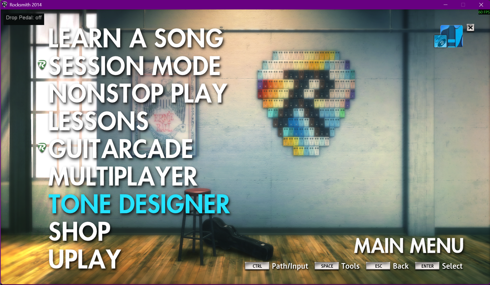
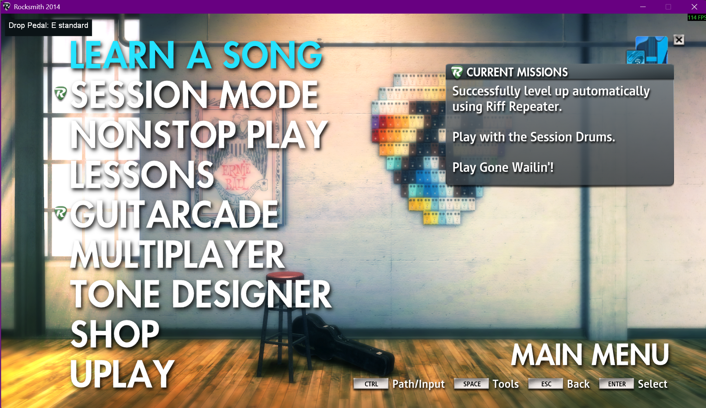

# Drop Pedal

Shifts your guitar's pitch inside Rocksmith 2014, and moves the pitch the game
expects by the same amount so note detection still agrees with what you're
playing. Range is -24 to +24 semitones.

To play an Eb song on a guitar in E standard, set the pedal to -1: the audio
drops a semitone and the game expects the notes a semitone lower, so E-standard
fingering registers.

---

## 1. Setup

The mod drives Rocksmith's own **MultiPitch** pedal, so it needs a tone that has
one. This is a one-off setup in the Tone Designer.

### 1.1 Build the tone

Add a **MultiPitch** to the tone and set it up like this:

| Setting | Value | Why |
|---|---|---|
| **Pitch 1** | `0.00` | The mod's shift is *additive*. Any non-zero value here offsets everything. |
| **Mix** | `100 %` | Defaults low. At 0 the shifted signal is inaudible. |
| **Tone** | anything | Taste only. |

Two things worth knowing before you build it:

- **MultiPitch can only occupy the pre-pedal slot, and there is exactly one.**
  Adding it *deletes* whatever pre-effect the tone already had.
- **A tone copied from an octave-down one still plays an octave down at 0
  semitones.** The tell is that shifting *up* by that amount sounds correct. The
  copy brought a non-zero Pitch 1 with it.

### 1.2 Assign it to a tone slot

Emulated bass has its **own** tone slots, but slot *numbers* are shared between
instruments. Put the guitar and bass drop pedal tones on **different slot
numbers**, as above with guitar on 2 and bass on 4, or you will be reassigning
them in the Tone Designer every time you switch instrument.

Rocksmith has no persistent tone selection: tones belong to the arrangement and
reset with every song, so you press the slot key each time.

---

## 2. Using it

| Action | Key |
|---|---|
| Pitch down / up | `,` / `.` |
| Toggle on / off | `F8` |
| Base tuning down / up | `F9` / `F10` |

These are fixed in V1 and cannot be reassigned. The settings app rebuilds
`RSMods.ini` from scratch every time you save, writing only the settings it knows
about, so a binding added to the file by hand would work until the next save and
then vanish without warning, silently reverting to the key above. Rebinding
arrives when the settings app carries these keys.

The overlay in the top left always shows the current state.

**Off.** Pitch keys are inert, nothing is shifted:

**On, at your base tuning.** No shift applied yet:

**On, shifted.** The readout turns green whenever the pedal is away from your
base tuning:

Range is -24 to +24 semitones. Nothing is saved between sessions: the pedal
starts at no shift, in E standard, every launch.

### Base tuning

`F9` / `F10` tell the mod what your guitar is *physically* tuned to. Leave it at
E standard if your guitar is in E standard. If you play in Eb, set the base to Eb
at the start of each session and the pedal offsets from there.

---

## 3. The one rule that matters

**Set the pedal before you enter the tuner.**

The game reads the expected tuning once, when the tuner comes up, and holds it
for the whole song. Changing the pedal mid-song moves *only* the audio. The game
carries on scoring against what it latched, so what you hear and what you're
graded on drift apart.

If you need to change it, back out to the menu, change the pedal, and go back in.
Re-entering the tuner re-latches the new value.

---

## 4. Limitations

**The overlay doesn't know whether your current tone has a MultiPitch.** If the
pedal appears to do nothing, the most likely cause is that the song loaded on its
default tone and you haven't pressed your slot key yet.

**The readout lags fast key presses.** It catches up; the pedal value itself is
correct.

---

## 5. Emulated bass

Bass works the same way guitar does. The audio shifts, the tuner follows, and
in-game note detection scores against the tuning you picked.

Setting it up has one extra step. Put the octave in the **tone**, not the pedal:

- **Tone:** `Pitch 1 = -12`. Adding a MultiPitch deletes the `Pedal_BassEmulator`
  that gives the tone its low end, so the tone sits in guitar register without
  this.
- **Pedal:** the song offset only, `-1` for an Eb song, not `-13`.

Both give identical audio, since it's the same shifter summing to the same total.
They are not interchangeable to the game: only the pedal value feeds the tuning
correction, so folding the octave into the pedal sends the expected pitch an
octave off. The audio sounds right and nothing you play registers.

---

## 6. Troubleshooting

| Symptom | Cause |
|---|---|
| Pedal changes nothing at all | Current tone has no MultiPitch, press your slot key |
| Audio shifts but sounds thin or silent | MultiPitch **Mix** isn't at 100 |
| Everything sounds an octave down at 0 semitones | Tone's **Pitch 1** isn't 0 |
| Notes don't register in-game | Pedal was changed after the tuner, back out and re-enter |
| Bass: audio right, nothing registers | Octave is in the pedal instead of the tone's Pitch 1 |
| Pitch keys do nothing | Pedal is toggled off (`F8`) |

The debug log is `RSMods_debug.txt`, next to `Rocksmith2014.exe`, not in the
`RSMods` subfolder. It is overwritten on every launch and locked while the game
runs, so quit before reading it.
